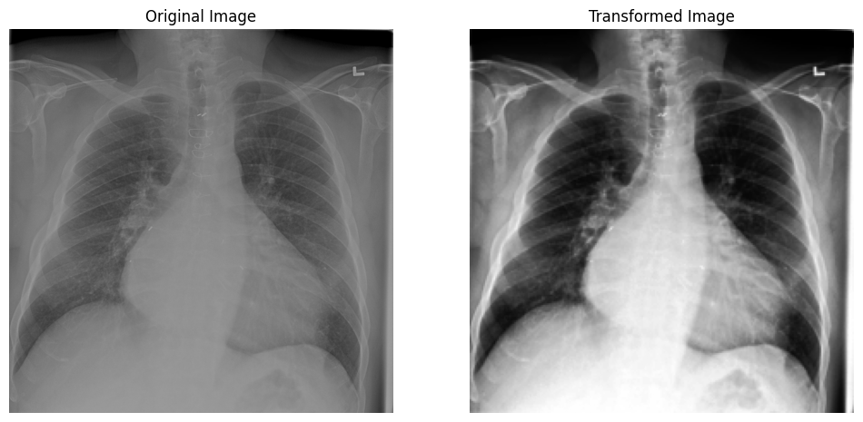
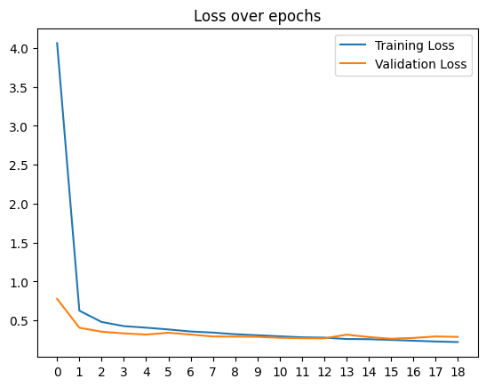

# Chest X-Ray Classification for Cardiomegaly Detection

This project focuses on classifying chest X-ray images to detect the presence of cardiomegaly (an enlarged heart). Using deep learning techniques, specifically the DenseNet-121 architecture, this model aims to assist in accurate medical diagnostics.

## Dataset

- The dataset contains over **10,000+ chest X-ray images**.
- Images were preprocessed using **histogram equalization** to enhance contrast and reduce noise, resulting in clearer samples for the classifier.

- 

## Model Architecture

- The model utilizes the **Efficient-b0** architecture, known for its efficient feature reuse and low training times on image classification tasks.

## Training Details

### Hyperparameters

- **Learning Rate**: 1e-5
- **Batch Size**: 32

### Optimizer and Regularization

- Applied **L2 regularization** to reduce overfitting.
- **Weight decay** value set to **1e-3**.

### Learning Rate Scheduler

- Implemented a **plateau learning rate scheduler** with:
  - **Patience**: 2 epochs
  - **Factor**: 0.1 (reduces learning rate by a factor of 0.1 when a plateau is detected)

### Early Stopping

- Used **early stopping** with a patience of 4 epochs to prevent overfitting.
- 

## Results

- Include details about the model’s accuracy, F1-score, or other relevant metrics.
- Test Accuracy: 0.8528
```
Classification Report:
              precision    recall  f1-score   support

           0       0.87      0.83      0.85       765
           1       0.93      0.91      0.92       708

    accuracy                           0.85      1473
   macro avg       0.90      0.87      0.88      1473
weighted avg       0.89      0.85      0.86      1473
```

## Usage

1. Clone this repository.
2. Prepare the dataset as per the required structure.
3. Run the jupyter notebook provided.

## Future Improvements

- Experimenting with additional image preprocessing techniques.
- Training a seperate image classifier to remove any distorted or noisy images that may affect model performance.
- Testing alternative model architectures such as ResNet or EfficientNet.
- Fine-tuning hyperparameters for further performance gains.


Feel free to customize and add more sections like Installation, Contributing, or additional notes specific to your project.

